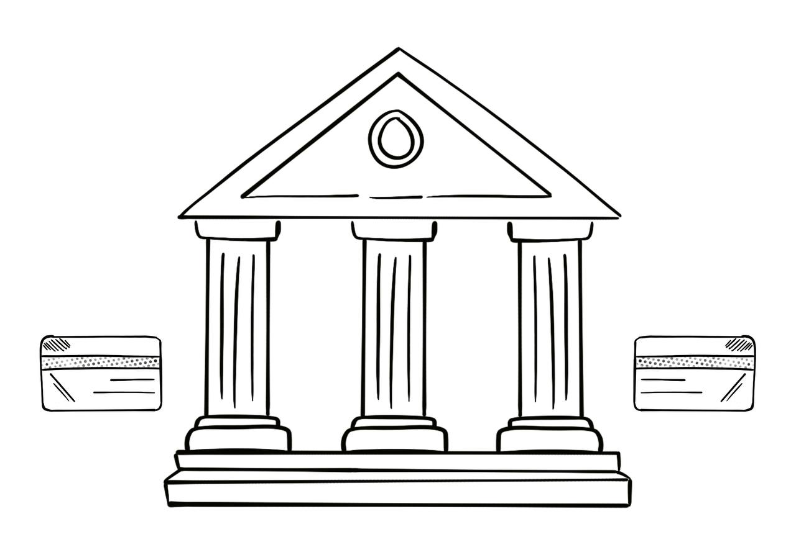
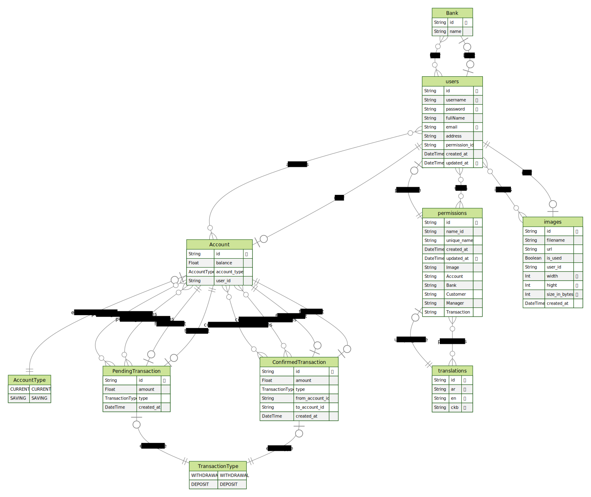

# Nest.js Banking System

Welcome to the Nest.js Banking System project! This repository contains the source code for a modern and secure banking system developed using the Nest.js framework.

## Table of Contents

- [Nest.js Banking System](#nestjs-banking-system)
  - [Table of Contents](#table-of-contents)
  - [Features](#features)
  - [Erd](#erd)
  - [Getting Started](#getting-started)
    - [Prerequisites](#prerequisites)
    - [Installation](#installation)
    - [Ensuring the security of the API](#ensuring-the-security-of-the-api)
    - [Standards and regulations](#standards-and-regulations)
  - [Technologies](#technologies)
    - [Node.js Advantages:](#nodejs-advantages)
    - [PostgreSQL Advantages:](#postgresql-advantages)


## Features


- **User Management**: Create, update, and manage user accounts with authentication and authorization mechanisms in place.

- **Account Management**: Enable users to create various types of accounts, such as savings, checking, and more.

- **Transaction Handling**: Facilitate secure and efficient transactions, including deposits, withdrawals, transfers, and transaction history tracking.

- **Security**: Implement robust security measures to protect user data and financial information. This includes encryption, access controls, and best practices for security.

- **Notifications**: Send notifications to users for various account activities, such as balance updates, transaction confirmations, and security alerts.

- **Reports and Analytics**: Generate reports and analytics for account holders to monitor their financial activities and make informed decisions.

## Erd



## Getting Started

Follow these steps to set up and run the Nest.js Banking System project on your local machine.

### Prerequisites

- [Node.js](https://nodejs.org/) installed on your system.
- A database system (e.g., PostgreSQL, MySQL, or SQLite) installed and configured.

### Installation

1. Clone the repository to your local machine:

   ```bash
   git clone https://github.com/losefor/banking-system.git

###  Ensuring the security of the API
- **Token-based Security:** If using tokens for authentication, make sure they are securely generated, transmitted, and stored. Implement token expiration and refresh mechanisms to mitigate the risk of token misuse.
- **Data Encryption:** Encrypt sensitive data at rest using strong encryption algorithms. This includes encrypting data stored in databases and any other storage systems.
- **Rate Limiting:** Enforce rate limiting to prevent abuse, brute force attacks, or denial-of-service (DoS) attacks. This helps ensure that the API is not overwhelmed by a large number of requests from a single user or IP address.
- **API Versioning:** Implement versioning in your API to ensure backward compatibility while allowing for updates and improvements. This helps prevent disruptions in service during updates.

### Standards and regulations 
https://github.com/gtonic/awesome-banking-tech

## Technologies 
### Node.js Advantages:
- Asynchronous I/O: Node.js is known for its non-blocking, event-driven architecture. This is particularly beneficial for handling a large number of concurrent requests, which is essential in a banking system where multiple users might be accessing the system simultaneously.
Scalability:

Node.js is designed to be scalable, allowing for the development of applications that can easily scale horizontally to handle increased load. This is crucial for a banking system that may experience varying levels of user activity.
- JavaScript Everywhere: Node.js allows for the use of JavaScript on both the client and server sides. This can lead to more efficient development and better collaboration between front-end and back-end development teams.
- Rich Ecosystem: Node.js has a rich ecosystem of packages and libraries available through npm (Node Package Manager). This can accelerate development by providing readily available modules for common functionalities.
- Community Support: Node.js has a large and active community, which means there is a wealth of resources, tutorials, and community support available. This can be beneficial for troubleshooting and finding solutions to challenges.
- Real-time Capabilities: Node.js is well-suited for applications that require real-time features. This can be advantageous for implementing real-time updates, notifications, and alerts in a banking system.
### PostgreSQL Advantages:
- ACID Compliance: PostgreSQL is known for its ACID (Atomicity, Consistency, Isolation, Durability) compliance. This ensures that transactions are reliable, consistent, and maintain data integrity, which is crucial in a banking system.
- Extensibility: PostgreSQL supports custom functions and extensions, allowing developers to tailor the database to specific requirements. This can be useful for implementing specialized financial calculations or features.
- Data Types and Indexing: PostgreSQL offers a wide range of data types and indexing options. This is beneficial when dealing with complex financial data and queries that require efficient indexing and searching capabilities.
- SQL Compliance: PostgreSQL fully supports SQL standards, making it compatible with a wide range of tools and ensuring that developers can leverage their SQL expertise.
- Open Source: Being open source, PostgreSQL is cost-effective and provides transparency in terms of source code. This can be advantageous for security audits and customization.
- Community Support: Similar to Node.js, PostgreSQL has a strong and active community. Regular updates, security patches, and community-contributed extensions are available, ensuring the database stays current and secure.